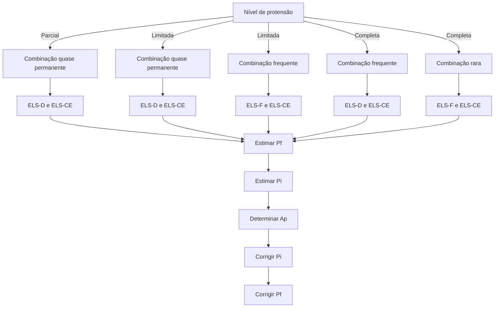

```mermaid
graph TD;
    A[Nível de protensão] -->|Parcial| B[Combinação quase permanente]
    B --> C[ELS-D e ELS-CE]

    A -->|Limitada| D[Combinação quase permanente]
    D --> E[ELS-D e ELS-CE]
    A -->|Limitada| F[Combinação frequente]
    F --> G[ELS-F e ELS-CE]

    A -->|Completa| H[Combinação frequente]
    H --> I[ELS-D e ELS-CE]
    A -->|Completa| J[Combinação rara]
    J --> K[ELS-F e ELS-CE]

    C --> L[Estimar Pf]
    E --> L
    G --> L
    I --> L
    K --> L
    L --> M[Estimar Pi]
    M --> N[Determinar Ap]
    N --> O[Corrigir Pi]
    O --> P[Corrigir Pf]
```